# Arquitetura de Dados — Sistema de Gestão de Obras (SGO)

> Este documento é uma **proposta de modelo de dados** (entidades, relações, esquema lógico),
> não um plano de implementação de código. Serve de base de design para o **Recorte 1**
> (backend real + auth) descrito em [2026-06-10-roadmap-sgo-design.md](2026-06-10-roadmap-sgo-design.md).
> Não há ainda decisão de stack/produto de banco — o modelo é desenhado para ser portável
> a qualquer RDBMS com suporte a tipos `ENUM`/`JSON` (PostgreSQL usado como referência de sintaxe).

## Contexto

O SGO hoje é **100% frontend** (React + TypeScript, Vite): todo o estado vive em `useState` dentro de
`src/App.tsx` (~4.200 linhas) e persiste em `localStorage` (`gesto_solicitacoes`, `sgo_notifications`,
`sgo_logs`, `vistorias`, `projetos`, `imoveis`, `budget-data`). Não há backend, API ou banco de dados —
autenticação e controle de acesso por perfil também são simulados no cliente.

A entidade central é `Solicitacao` (`src/types.ts`), com ~100 campos cobrindo 8 domínios (identificação
escolar, classificação patrimonial, demanda/notificação, prioridade, complexidade IEE, PAF, contratação,
execução) e workflow `etapaAtual: EtapaProcesso` (`cadastro → analise → (correcao) → paf_autorizacao → paf
→ ordem_inicio → execucao`, + `cancelado`). Diversas sub-estruturas hoje vivem como **arrays aninhados**
dentro da própria `Solicitacao` (documentos, medições, aditivos, ajustes, histórico de etapas etc.), sem
normalização nem FK real entre módulos (ex.: `Solicitacao` ↔ `ImovelPatrimonio` se relacionam só por
`codesc` em texto livre).

O objetivo deste documento é **propor como essa estrutura deveria ser normalizada** caso/quando o Recorte 1
implemente um backend real, sem ainda escrever código — decisões de modelagem, o porquê de cada uma, e um
diagrama ER cobrindo as ~26 entidades principais identificadas no frontend atual.

## Princípios gerais adotados

1. **Banco relacional genérico** como modelo de referência (tipos `JSONB`, `ENUM`, `UUID` no estilo
   PostgreSQL), mas a lógica vale para qualquer RDBMS com suporte a JSON e check constraints.
2. **Granularidade da normalização guiada por padrão de acesso, não por "pureza" de normalização**: um
   array aninhado só migra para tabela própria se (a) precisa ser consultado/filtrado/agregado
   independentemente da Solicitação pai, (b) tem cardinalidade crescente sem limite natural (auditoria,
   medições), ou (c) tem regras de integridade próprias (FK para usuário, workflow de status). Caso
   contrário, permanece como `JSONB` embutido.
3. **Nenhum arquivo binário fica no banco relacional.** O `fileContent` em base64 hoje embutido no JSON
   sai para object storage externo; tabelas de domínio guardam só o ponteiro.
4. **Enums fechados e estáveis do workflow** (etapas, perfis, status) usam `ENUM` nativo; **conjuntos
   cadastráveis pelo usuário** (SRE, tipo de obra, município) usam tabela de lookup.
5. **Campos calculados são materializados** (colunas persistidas), recalculados em camada de aplicação
   no momento do save — não em trigger SQL nem em runtime de leitura.

---

## Decisão 1 — Quais arrays viram tabela própria vs. permanecem JSONB

| Array hoje em `Solicitacao` | Decisão | Justificativa |
|---|---|---|
| `historicoEtapas[]` | **Tabela própria** `solicitacao_historico_etapas` | Append-only, auditoria formal (quem moveu o processo, quando). Precisa ser filtrável/ordenável em relatórios de SLA entre processos. Cresce indefinidamente — não deve inflar a linha principal. |
| `historicoCorrecoes[]` (+ `motivos[]`, `docsRecusados[]`) | **Tabela própria** `solicitacao_historico_correcoes` + filhas `historico_correcao_motivos` / `historico_correcao_docs_recusados` | Auditoria + base para relatórios de qualidade de dossiê ("quais campos mais geram correção"). |
| `retornosAdministrativos[]` | **Tabela própria** `solicitacao_retornos_administrativos` | Trilha de auditoria sensível e distinta de `historicoEtapas` (o próprio código já a trata como separada). `usuario` passa a ser FK real para `usuarios.id`. |
| `documentos[]` / `outrosDocumentos[]` | **Tabela única `documentos`** com `categoria` (checklist_obrigatorio, checklist_outros, aditivo, ajuste, ordem_inicio, distrato, conclusao, patrimonio, medicao_foto, vistoria_foto...) | Precisa de listagem cross-processo ("tudo pendente de aprovação") e ciclo de vida próprio. O `fileContent` base64 sai para object storage (ver Decisão 3). |
| `medicoes[]` | **Tabela própria** `medicoes` | Alimenta `status_obra` computado (`SUM(valor)` vs. orçamento) e relatórios financeiros agregados por SRE/período. |
| `aditivos[]` | **Tabela própria** `aditivos` | Workflow próprio (Pendente/Aprovado/Recusado), analista atribuído (FK), impacta etiqueta `SEM_LIB_FINANCEIRA`. `checklistDocs[]` interno fica `JSONB` (checklist fixa pequena). |
| `ajustes[]` | **Tabela própria** `ajustes_planilha` | Mesmo racional dos aditivos (workflow + analista + volume de campos financeiros). |
| `parcelasPAF[]` | **Tabela própria** `parcelas_paf` | Base do cálculo de `statusPAF`; precisa de `SUM(valor)` e ordenação por data de pagamento. |
| `reequilibrios[]` | **Tabela própria** `reequilibrios_financeiros` | Workflow + analista atribuído, mesmo padrão de aditivos/ajustes. |
| `saldosComplementares[]` | **Tabela própria** `saldos_complementares` | Mesmo padrão; o subarray `documentos[]` (item/obrigatorio/checked) é checklist fixa pequena → fica `JSONB`. |
| `empresasAnteriores[]` | **Tabela própria** `solicitacao_empresas_contrato` | Histórico completo de contratação (inclusive a empresa atual, `is_atual=true`); permite relatório de empresas com distrato recorrente entre processos. |
| `diariosObra[]` | **Tabela própria** `diarios_obra` | Volume potencialmente grande (lançamento periódico durante toda a execução); mesmo padrão de log/timeline de `historicoEtapas`. |
| `restricoesObra[]` | **Tabela própria** `restricoes_obra` | Workflow (Ativa/Resolvida) + SLA implícito; precisa ser consultável cross-obra ("painel de restrições ativas"). |
| `vistoriasObra[]` | **Tabela própria** `vistorias_obra` (distinta de `vistorias_imovel`, ver Decisão 5) | Histórico cronológico com resultado, relevante para relatórios de qualidade de execução. |
| `statusSecoes` (mapa de 4 chaves fixas) | **4 colunas na própria tabela `solicitacoes`** (não tabela separada, não JSONB) | Mapa fixo e pequeno (4 seções do domínio, não crescem), sempre lido/escrito junto com o resto do registro principal. Permite `CHECK`/índice parcial sem overhead de JOIN. |
| `valoresOriginaisTecnico` (snapshot de chaves dinâmicas) | **JSONB embutido** | Snapshot ad-hoc cujas chaves variam conforme `SECAO_CAMPOS` no código — tabela própria geraria migração de schema a cada mudança de regra. Usado só para diff em memória, sem necessidade de query relacional. |
| `outrosAnexosOrdemInicio[]` | **Tabela `documentos`** (categoria='ordem_inicio') | Mesmo tratamento de qualquer outro anexo — não há razão para tratamento especial. |

**Critério-resumo:** tabela própria quando há (1) auditoria/compliance formal, (2) volume crescente sem
limite natural, (3) workflow/status próprio com FK para responsável, ou (4) necessidade de
agregação/filtro cross-processo. JSONB quando a estrutura é fixa e pequena, sem necessidade de query
relacional independente.

---

## Decisão 2 — Campos calculados: materializar, não derivar em runtime

Campos: `prioridade_score`, `estrelas`, `etiquetas_prioridade`, `iee`, `iee_classe`, `iee_pontos`,
`iee_complexidade`, `status_obra`.

**Materializar (colunas persistidas), recalculadas na camada de aplicação a cada save** — não em trigger
SQL, não em runtime de leitura.

- **Por quê materializar:** são a base de ordenação/filtro de listagens grandes (Kanban por prioridade,
  fila por estrelas+score) e de regras cross-registro (`SUM(iee_pontos) WHERE analista_id = X` para a
  capacidade de 35 pts) — inviável calcular em runtime sem coluna indexável.
- **Por quê não trigger SQL:** a lógica de `calcularIEE`/`calcularPrioridade` é rica e muda com
  frequência (regras institucionais evoluem); duplicar essa lógica em PL/pgSQL e TypeScript dificulta
  testes e manutenção. A regra já tem hoje um **chokepoint único de persistência** no frontend
  (`recalcularPrioridade`/`recalcularIEE` chamados a cada save em `App.tsx`) — a migração natural é
  replicar esse chokepoint na camada de serviço do backend.
- **Mitigação do risco de dado desatualizado:** job de reconciliação periódico (idempotente, batch) que
  recalcula e corrige divergências — rede de segurança para migração de dados ou mudança retroativa de
  regra de negócio.
- **`status_obra` é o caso mais sensível** porque depende de agregação de outra tabela (`SUM(medicoes.valor)`).
  Mesma decisão (materializar), mas com recálculo explicitamente disparado em pontos de mutação conhecidos
  (nova medição, mudança de etapa, paralisação/distrato) via um método de domínio único
  `recomputeStatusObra(solicitacaoId)` — não trigger automático, pela lógica condicional que mistura
  múltiplas tabelas.

---

## Decisão 3 — Documentos/anexos sem binário no relacional

```
documentos
├── id                  UUID PK
├── solicitacao_id      FK → solicitacoes.id   (nullable)
├── aditivo_id          FK → aditivos.id        (nullable)
├── ajuste_id           FK → ajustes_planilha.id (nullable)
├── imovel_id           FK → imoveis_patrimonio.id (nullable)
├── categoria           ENUM documento_categoria
├── nome_logico         TEXT NOT NULL
├── obrigatorio         BOOLEAN DEFAULT false
├── status              ENUM documento_status   -- pendente | aprovado | recusado | nao_se_aplica
├── justificativa       TEXT
├── storage_provider    TEXT                    -- 's3' | 'azure_blob' | 'gcs' | 'local_fs'
├── storage_path        TEXT NOT NULL           -- chave do objeto, não a URL assinada
├── file_name / file_type / file_size_bytes
├── checksum_sha256     TEXT                    -- integridade/dedupe
├── uploaded_by         FK → usuarios.id
└── uploaded_at, created_at, updated_at
```

- Exatamente **um** FK de entidade-pai preenchido por linha (`CHECK` de exclusividade), em vez de uma
  associação polimórfica genérica — mais simples de indexar e com integridade referencial real.
- `storage_path` é a chave no object storage; a URL de download é gerada on-demand pela aplicação (nunca
  persistida, pois expira).
- `checksum_sha256` permite detectar duplicidade/corrupção — relevante para evidência documental em
  processo público.
- Migração do `fileContent` base64 legado: rotina one-time que decodifica e grava no storage, populando
  `storage_path` (fica fora do escopo deste design, mas o modelo já comporta essa entrada).

---

## Decisão 4 — Modelagem de enums

| Campo | Tratamento | Motivo |
|---|---|---|
| `EtapaProcesso` | ENUM nativo | Fechado, parte do motor de workflow (`etapas.ts`), baixa frequência de mudança. |
| `PerfilUsuario` | ENUM nativo (fecha o escape `\| string` hoje existente) | Perfil carrega permissão — não deve ser valor livre; legado é exceção, não regra. |
| `StatusValidacao`, `StatusObraComputado`, `ClasseIEE` | ENUM nativo | Fechados, gerados por função de domínio fixa. |
| Status de `Aditivo`, `AjustePlanilha`, `ReequilibrioItem`, `SaldoComplementarItem`, `DocumentoChecklist` | ENUM nativo **por tabela** | Cada workflow é fechado e semanticamente próprio — não vale unificar. |
| **SRE** (`sre`) | Tabela de lookup `regionais_sre` | Hoje string livre repetida em 3 entidades, comparada com `.toLowerCase()` — sintoma direto de dado não normalizado. Precisa ser FK-able para RBAC (Decisão 6). |
| **Tipo de obra** | Tabela de lookup `tipos_obra` (id, nome, nota_iee) | A nota do IEE é dado de negócio (pode mudar por portaria), e unifica os dois campos legados `tipo`/`tipoObra`. |
| **Município** | Tabela de lookup `municipios` (id, nome, codigo_ibge) | Lista fixa de ~853 municípios de MG, hoje hardcoded no frontend. |
| Campos de uso único e baixo impacto (`garantiaTipo`, `origemDemanda`, categorias de diário) | `TEXT` + `CHECK ... IN (...)` | ENUM nativo exigiria `ALTER TYPE` para cada novo valor — rigidez desproporcional ao risco. |

**Regra geral:** lista `as const` fechada usada em lógica de workflow → ENUM nativo; array
populado/editado por tela de cadastro → tabela de lookup.

---

## Decisão 5 — Relação `Solicitacao` ↔ `ImovelPatrimonio`

**Hoje:** sem FK. `FichaConsolidadaView.tsx` cruza por `codesc`/nome em texto livre. Campos
(`formaOcupacao`, `predio`, `tombado`, `orgaoTombador`, `coabitado`, `tipoCoabitado`) existem
**duplicados e digitados independentemente** em `Solicitacao` e em `ImovelPatrimonio` — sem validação
cruzada, o que é um bug de integridade latente (ex.: um lado diz "tombado", outro diz "não tombado" para
o mesmo imóvel).

**Proposta:** `solicitacoes.imovel_id` como FK **nullable** para `imoveis_patrimonio.id`, eliminando a
duplicação dos campos patrimoniais em `Solicitacao` (passam a ser lidos via `JOIN`).

- Nullable porque o imóvel pode ainda não estar cadastrado em Patrimônio quando uma obra é solicitada —
  o cadastro patrimonial pode vir depois.
- Campos de **validação** (`statusSecoes.classificacao_patrimonial`) continuam em `Solicitacao`: validar
  é ação do processo de análise, não atributo do imóvel.
- **Migração de dados legados não é trivial**: como os dois lados podem hoje divergir, é preciso uma
  rotina de reconciliação (relatório de divergências por `codesc` + decisão humana) antes de remover as
  colunas duplicadas — etapa própria do plano de migração, não deste documento de design.
- `vistoriasObra` (execução de obra em andamento) e a vistoria do módulo Patrimônio (estado físico do
  imóvel, independente de obra em curso) permanecem **tabelas distintas** (`vistorias_obra` com FK para
  `solicitacao_id`, `vistorias_imovel` com FK para `imovel_id`) — são conceitos diferentes apesar do nome
  parecido.

---

## Decisão 6 — RBAC extensível

**Problema atual:** `perfil` é string em `UsuarioSistema` (tipo já admite escape `\| string`), e toda
permissão é checada via condicionais hardcoded espalhadas em `App.tsx` (`perfilUsuario === 'tecnico_infra'`
em dezenas de pontos). Vínculo regional é array de strings de nome de SRE, sem FK.

**Proposta:**

```
perfis(id, codigo, nome_exibicao, descricao)
permissoes(id, codigo, descricao)
perfil_permissoes(perfil_id FK, permissao_id FK)        -- N:N
usuarios(..., perfil_id FK, capacidade_maxima_iee)      -- substitui perfil: string
usuario_regionais(usuario_id FK, sre_id FK → regionais_sre)  -- N:N, substitui regionais: string[]
```

- **`perfis` × `permissoes` em N:N** permite mudar capacidades de um perfil via INSERT, sem deploy —
  resolve a fragilidade dos `if (perfil === 'x')` hoje espalhados na UI.
- **`usuario_regionais` como tabela própria** dá FK real para `regionais_sre`, suporta multi-vínculo (já
  existe conceitualmente como `regionais?: string[]`) com integridade referencial.
- A regra "`tecnico_infra` só vê solicitações da própria SRE ou onde é fiscal" é uma política de
  **escopo de dado** (linha), não de **ação** — fica modelada separadamente (regra de aplicação ou RLS),
  consultando `usuario_regionais` e `solicitacoes.fiscal_obra_atribuido_id`. Hoje as duas dimensões estão
  misturadas no mesmo `if`; a separação é deliberada.
- `capacidade_maxima_iee` permanece atributo do **usuário**, não do perfil — característica individual
  (confirmado pela inconsistência hoje existente entre o default do campo no código e a constante de
  regra `CAPACIDADE_MAXIMA_ANALISTA = 35`, que a normalização também expõe/corrige).

---

## Diagrama Entidade-Relacionamento

```mermaid
erDiagram
    USUARIOS ||--o{ USUARIO_REGIONAIS : possui
    PERFIS ||--o{ USUARIOS : classifica
    PERFIS ||--o{ PERFIL_PERMISSOES : concede
    PERMISSOES ||--o{ PERFIL_PERMISSOES : concedida_em
    REGIONAIS_SRE ||--o{ USUARIO_REGIONAIS : vincula

    REGIONAIS_SRE ||--o{ SOLICITACOES : sre_id
    MUNICIPIOS ||--o{ SOLICITACOES : municipio_id
    TIPOS_OBRA ||--o{ SOLICITACOES : tipo_obra_id

    IMOVEIS_PATRIMONIO ||--o{ SOLICITACOES : "imovel_id (nullable)"
    IMOVEIS_PATRIMONIO ||--o{ PROJETOS_ESCOLARES : imovel_id
    IMOVEIS_PATRIMONIO ||--o{ VISTORIAS_IMOVEL : imovel_id
    IMOVEIS_PATRIMONIO ||--o{ DOCUMENTOS : imovel_id

    SOLICITACOES ||--o{ SOLICITACAO_HISTORICO_ETAPAS : solicitacao_id
    SOLICITACOES ||--o{ SOLICITACAO_HISTORICO_CORRECOES : solicitacao_id
    SOLICITACAO_HISTORICO_CORRECOES ||--o{ HISTORICO_CORRECAO_MOTIVOS : correcao_id
    SOLICITACAO_HISTORICO_CORRECOES ||--o{ HISTORICO_CORRECAO_DOCS_RECUSADOS : correcao_id
    SOLICITACOES ||--o{ SOLICITACAO_RETORNOS_ADMINISTRATIVOS : solicitacao_id

    SOLICITACOES ||--o{ DOCUMENTOS : solicitacao_id
    SOLICITACOES ||--o{ MEDICOES : solicitacao_id
    SOLICITACOES ||--o{ ADITIVOS : solicitacao_id
    ADITIVOS ||--o{ DOCUMENTOS : aditivo_id
    SOLICITACOES ||--o{ AJUSTES_PLANILHA : solicitacao_id
    AJUSTES_PLANILHA ||--o{ DOCUMENTOS : ajuste_id
    SOLICITACOES ||--o{ PARCELAS_PAF : solicitacao_id
    SOLICITACOES ||--o{ REEQUILIBRIOS_FINANCEIROS : solicitacao_id
    SOLICITACOES ||--o{ SALDOS_COMPLEMENTARES : solicitacao_id
    SOLICITACOES ||--o{ SOLICITACAO_EMPRESAS_CONTRATO : solicitacao_id
    SOLICITACOES ||--o{ DIARIOS_OBRA : solicitacao_id
    SOLICITACOES ||--o{ RESTRICOES_OBRA : solicitacao_id
    SOLICITACOES ||--o{ VISTORIAS_OBRA : solicitacao_id

    USUARIOS ||--o{ SOLICITACOES : analista_atribuido_id
    USUARIOS ||--o{ SOLICITACOES : fiscal_obra_atribuido_id
    USUARIOS ||--o{ ADITIVOS : analista_atribuido_id
    USUARIOS ||--o{ AJUSTES_PLANILHA : analista_atribuido_id
    USUARIOS ||--o{ DOCUMENTOS : uploaded_by

    SOLICITACOES ||--o{ NOTIFICACOES : solicitacao_id
    SOLICITACOES ||--o{ SISTEMA_LOGS : solicitacao_id
    USUARIOS ||--o{ SISTEMA_LOGS : usuario_id

    BUDGETS ||--o{ EAP_ITEMS : budget_id
    EAP_ITEMS ||--o{ EAP_ITEMS : parent_id
    EAP_ITEMS }o--|| COMPOSITIONS : composition_id
    COMPOSITIONS ||--o{ COMPOSITION_RESOURCES : composition_id
    RESOURCES ||--o{ COMPOSITION_RESOURCES : resource_id
    BUDGETS ||--o{ BUDGET_VERSIONS : budget_id
    SOLICITACOES ||--o| BUDGETS : "solicitacao_id (nullable, via codesc hoje)"

    SOLICITACOES {
        uuid id PK
        text codesc
        uuid municipio_id FK
        uuid sre_id FK
        uuid imovel_id FK "nullable"
        etapa_processo etapa_atual
        int prioridade_score "materializado"
        int estrelas "materializado"
        numeric iee "materializado"
        classe_iee iee_classe "materializado"
        status_obra_computado status_obra "materializado"
        status_validacao status_identificacao_escolar
        status_validacao status_classificacao_patrimonial
        status_validacao status_detalhamento_tecnico
        status_validacao status_referencia_dotacao
        uuid analista_atribuido_id FK
        uuid fiscal_obra_atribuido_id FK
        jsonb valores_originais_tecnico
    }

    IMOVEIS_PATRIMONIO {
        uuid id PK
        text codesc
        uuid municipio_id FK
        uuid sre_id FK
        text forma_ocupacao
        text tombado
        text coabitado
        text situacao_imovel
        text status
    }

    USUARIOS {
        uuid id PK
        text nome
        text email
        uuid perfil_id FK
        int capacidade_maxima_iee
    }
```



*(diagrama resumido às ~26 entidades principais; tabelas de lookup simples como `regionais_sre`,
`municipios`, `tipos_obra`, `permissoes`, `perfis` aparecem como nós, sem todos os atributos, por
legibilidade.)*

**Nota:** o módulo de Orçamento (`Budgets`/`EAPItems`/`Compositions`/`Resources`) está hoje desconectado
de `Solicitacao` — vinculado só por `codesc` textual, mesma observação de duplicação da Decisão 5.

---

## Resumo das 6 decisões

1. Tabela própria para todo array com workflow/auditoria/volume crescente; `JSONB` só para snapshot
   ad-hoc (`valoresOriginaisTecnico`) e checklists fixas pequenas; `statusSecoes` torna-se 4 colunas na
   própria tabela `solicitacoes`.
2. Campos calculados (`prioridade_score`, `iee`, `status_obra`...) são **materializados**, recalculados
   em camada de aplicação num chokepoint único de escrita, com job de reconciliação batch como rede de
   segurança.
3. Documentos apontam para object storage externo (`storage_provider`/`storage_path`/`checksum_sha256`);
   tabela `documentos` unificada com FK exclusiva para a entidade-pai.
4. Enums fechados de workflow usam ENUM nativo; conjuntos cadastráveis (SRE, município, tipo de obra)
   usam tabela de lookup.
5. `Solicitacao.imovel_id` FK nullable para `ImovelPatrimonio`, eliminando duplicação de campos
   patrimoniais — com necessidade de reconciliação de dados divergentes antes da migração definitiva.
6. RBAC modelado como `perfis` × `permissoes` (N:N) + `usuario_regionais` (N:N), separando "o que o
   perfil pode fazer" de "quais SREs o usuário atende".

## Arquivos do frontend usados como fonte deste modelo

- `src/types.ts` — definição de `Solicitacao` e tipos relacionados
- `src/utils/prioridade.ts`, `src/utils/iee.ts` — regras de cálculo hoje em memória
- `src/utils/validacaoTecnica.ts`, `src/utils/etapas.ts` — workflow e validação por seção
- `src/components/patrimonio/types.ts` — `ImovelPatrimonio`, `DocumentoPatrimonio`
- `src/components/orcamento/types.ts` — `Budget`, `EAPItem`, `Composition`, `Resource`

## Próximos passos

Este documento ainda não é plano de implementação. Os próximos passos naturais (fora deste escopo):
1. Validar as 6 decisões com o time (especialmente Decisão 5, que exige reconciliação de dados antes da
   migração, e Decisão 6, que muda o modelo de permissões hoje hardcoded).
2. Decidir a stack de backend/banco (pendência já registrada no roadmap do Recorte 1).
3. Abrir o spec de implementação do Recorte 1 com este modelo como base de schema.
