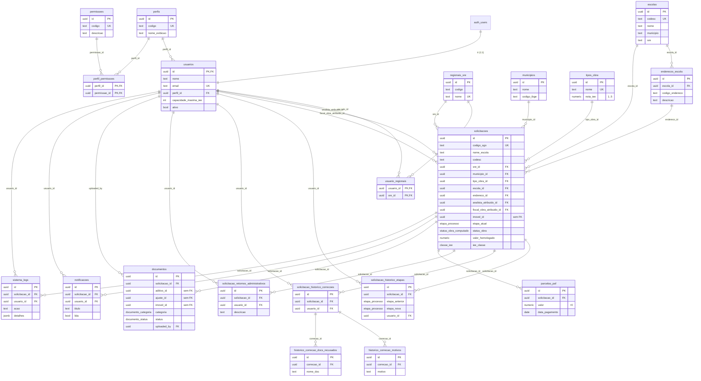

# Dicionário de Dados & DER/MER — SGO

> **Fonte:** banco Postgres do Supabase (`https://oabqskuomgiuglailaia.supabase.co`), inspecionado via MCP.
> **Data da extração:** 2026-07-02 · **Schema:** `public`
> **Resumo:** 20 tabelas · 7 tipos ENUM · 96 check constraints · 2 triggers · 1 função · 0 views · **RLS habilitado em todas as tabelas**.

## Observações de governança (ler antes)

- ⚠️ **0 migrations rastreadas** (`supabase_migrations` vazio) — o schema foi criado direto no banco, sem arquivos de migration versionados. Recomenda-se capturar o estado atual como baseline (`supabase db pull` / migration inicial) antes de evoluir.
- ✅ **A fundação do Recorte #1 já existe no banco**, embora o front-end (`src/`) ainda **não consuma** nada disso (segue em `localStorage`). Ou seja: modelagem de dados adiantada, integração de aplicação pendente.
- 📦 **Dados de referência já carregados:** `escolas` (3.444), `enderecos_escola` (3.910), `regionais_sre` (47), `tipos_obra` (6), `perfis` (7), `usuarios` (5), `solicitacoes` (5). As tabelas transacionais/histórico estão vazias (0 linhas).
- 🔗 **Colunas "penduradas" (uuid sem FK)** — apontam para domínios ainda não modelados (recortes futuros):
  - `solicitacoes.imovel_id`, `documentos.imovel_id` → **Imóveis** (Recorte #4, sem tabela ainda).
  - `documentos.aditivo_id`, `documentos.ajuste_id` → **Execução** (aditivos/ajustes, Recorte #2, sem tabela ainda).
- 🧬 **Campos denormalizados** em `solicitacoes` (`sre`, `municipio`, `tipo`) coexistem com as FKs (`sre_id`, `municipio_id`, `tipo_obra_id`) — provável resquício da migração do protótipo `localStorage`; definir qual é a fonte de verdade.
- 👤 O ENUM `perfil_usuario` tem 7 valores (inclui `admin`), mas a tabela `perfis` usa `codigo text` (não o enum) — o enum pode estar sem uso efetivo.

---

## DER / MER (diagrama entidade-relacionamento)

> Cardinalidade: `||--o{` = um-para-muitos (o lado `||` é a entidade "pai"/alvo da FK). `usuarios` liga-se a `solicitacoes` por **duas** FKs (analista e fiscal). `usuarios.id` é 1:1 com `auth.users.id` (autenticação do Supabase).

---

## Tipos ENUM (domínios customizados)

| ENUM | Valores | Usado em |
|---|---|---|
| `etapa_processo` | `cadastro, analise, correcao, paf_autorizacao, paf, ordem_inicio, execucao, cancelado` | `solicitacoes.etapa_atual`, `solicitacao_historico_etapas.etapa_anterior/nova` |
| `status_validacao` | `pendente, validado, nao_validado, editado` | 4 blocos de validação em `solicitacoes` (identificação, patrimonial, técnico, dotação) |
| `status_obra_computado` | `nao_iniciada, em_andamento, paralisada, concluida, distratada` | `solicitacoes.status_obra` |
| `classe_iee` | `I, II, III, IV` | `solicitacoes.iee_classe` |
| `documento_categoria` | `checklist_obrigatorio, checklist_outros, aditivo, ajuste, ordem_inicio, distrato, conclusao, patrimonio, medicao_foto, vistoria_foto` | `documentos.categoria` |
| `documento_status` | `pendente, aprovado, recusado, nao_se_aplica` | `documentos.status` |
| `perfil_usuario` | `tecnico_infra, gestor_dore, analista_dore, gestor_paf, fiscal_obra, administrativo_dore, admin` | *(definido; `perfis` usa `codigo text`, não este enum)* |

---

## Dicionário de dados por tabela

Convenção: **PK** chave primária · **FK** chave estrangeira · **UK** único · "Nulo" = aceita NULL.

### Domínio: Referência / Cadastros base

#### `regionais_sre` — Superintendências Regionais de Ensino (SRE) · 47 linhas
| Coluna | Tipo | Nulo | Default | Observações |
|---|---|---|---|---|
| id | uuid | não | gen_random_uuid() | **PK** |
| codigo | text | não | — | |
| nome | text | não | — | **UK** |

#### `municipios` — Municípios de MG · 0 linhas
| Coluna | Tipo | Nulo | Default | Observações |
|---|---|---|---|---|
| id | uuid | não | gen_random_uuid() | **PK** |
| nome | text | não | — | |
| codigo_ibge | text | sim | — | |

#### `tipos_obra` — Tipos de obra e nota IEE · 6 linhas
| Coluna | Tipo | Nulo | Default | Observações |
|---|---|---|---|---|
| id | uuid | não | gen_random_uuid() | **PK** |
| nome | text | não | — | **UK** |
| nota_iee | numeric | não | — | check `1 ≤ nota_iee ≤ 5` |

#### `escolas` — Cadastro de escolas estaduais · 3.444 linhas
| Coluna | Tipo | Nulo | Default | Observações |
|---|---|---|---|---|
| id | uuid | não | gen_random_uuid() | **PK** |
| codesc | text | não | — | **UK** — código da escola |
| nome | text | não | — | |
| municipio | text | não | — | |
| sre | text | não | — | |
| ativo | bool | não | true | |
| created_at | timestamptz | não | now() | |

#### `enderecos_escola` — Endereços/prédios por escola · 3.910 linhas
| Coluna | Tipo | Nulo | Default | Observações |
|---|---|---|---|---|
| id | uuid | não | gen_random_uuid() | **PK** |
| codigo_endereco | text | não | — | |
| escola_id | uuid | sim | — | **FK** → `escolas.id` |
| codesc | text | não | — | |
| descricao | text | não | — | |
| ativo | bool | não | true | |
| created_at | timestamptz | não | now() | |

### Domínio: Segurança / Usuários & Permissões

#### `perfis` — Perfis/papéis de usuário · 7 linhas
| Coluna | Tipo | Nulo | Default | Observações |
|---|---|---|---|---|
| id | uuid | não | gen_random_uuid() | **PK** |
| codigo | text | não | — | **UK** (ex.: `analista_dore`) |
| nome_exibicao | text | não | — | |
| descricao | text | sim | — | |

#### `permissoes` — Catálogo de permissões · 0 linhas
| Coluna | Tipo | Nulo | Default | Observações |
|---|---|---|---|---|
| id | uuid | não | gen_random_uuid() | **PK** |
| codigo | text | não | — | **UK** |
| descricao | text | não | — | |

#### `perfil_permissoes` — N:N perfil × permissão · 0 linhas
| Coluna | Tipo | Nulo | Default | Observações |
|---|---|---|---|---|
| perfil_id | uuid | não | — | **PK, FK** → `perfis.id` |
| permissao_id | uuid | não | — | **PK, FK** → `permissoes.id` |

#### `usuarios` — Usuários do sistema · 5 linhas
| Coluna | Tipo | Nulo | Default | Observações |
|---|---|---|---|---|
| id | uuid | não | — | **PK, FK** → `auth.users.id` (1:1) |
| nome | text | não | — | |
| email | text | não | — | **UK** |
| perfil_id | uuid | não | — | **FK** → `perfis.id` |
| capacidade_maxima_iee | int4 | não | 35 | carga máx. de análise |
| ativo | bool | não | true | |
| created_at | timestamptz | não | now() | |

#### `usuario_regionais` — N:N usuário × SRE · 0 linhas
| Coluna | Tipo | Nulo | Default | Observações |
|---|---|---|---|---|
| usuario_id | uuid | não | — | **PK, FK** → `usuarios.id` |
| sre_id | uuid | não | — | **PK, FK** → `regionais_sre.id` |

### Domínio: Núcleo do processo

#### `solicitacoes` — **Entidade central** (demanda de obra) · 5 linhas
| Coluna | Tipo | Nulo | Default | Observações |
|---|---|---|---|---|
| id | uuid | não | gen_random_uuid() | **PK** |
| codigo_sgo | text | sim | — | **UK** — código SGO |
| nome_escola | text | não | — | |
| codesc | text | não | — | código da escola |
| sre_id | uuid | sim | — | **FK** → `regionais_sre.id` |
| municipio_id | uuid | sim | — | **FK** → `municipios.id` |
| tipo_obra_id | uuid | sim | — | **FK** → `tipos_obra.id` |
| imovel_id | uuid | sim | — | ⚠️ sem FK (domínio Imóveis futuro) |
| sre | text | sim | — | denormalizado |
| municipio | text | sim | — | denormalizado |
| tipo | text | sim | — | denormalizado |
| etapa_atual | `etapa_processo` | não | `cadastro` | etapa do fluxo |
| tipo_atendimento | text | sim | — | |
| atendimento_orgao | text | sim | — | |
| forma_atendimento | text | sim | — | |
| origem_demanda | text | sim | — | check: Escola / SRE / Programa Gov. / Fiscalização / Notificação / Determ. Judicial / Atend. Político |
| num_paf | text | sim | — | |
| ano_emenda | text | sim | — | |
| emenda_impositiva | text | sim | — | check `Sim`/`Não` |
| descricao_folha_rosto | text | sim | — | |
| valor_planilha | numeric | sim | — | |
| valor_homologado | numeric | sim | — | |
| numero_paf | text | sim | — | |
| data_homologacao | date | sim | — | |
| data_vigencia_paf | date | sim | — | |
| data_fin_homologacao | date | sim | — | |
| status_paf | text | sim | — | check: Aguardando Geração / Aguardando Pagamento / Pago Parcialmente / Pago e Liberado |
| cnpj_caixa_escolar | text | sim | — | |
| valor_contrato | numeric | sim | — | |
| prazo_estimado_obra | int4 | sim | — | |
| prazo_estimado_meses | int4 | sim | — | |
| iss | text | sim | — | |
| codigo_endereco | text | sim | — | |
| forma_ocupacao | text | sim | — | |
| predio | text | sim | — | |
| tombado | text | sim | — | |
| orgao_tombador | text | sim | — | |
| coabitado | text | sim | — | |
| tipo_coabitado | text | sim | — | |
| ficha_verificada | bool | não | false | |
| observacoes_ficha | text | sim | — | |
| status_identificacao_escolar | `status_validacao` | não | `pendente` | bloco de validação DORE |
| motivo_identificacao_escolar | text | sim | — | |
| status_classificacao_patrimonial | `status_validacao` | não | `pendente` | bloco de validação DORE |
| motivo_classificacao_patrimonial | text | sim | — | |
| status_detalhamento_tecnico | `status_validacao` | não | `pendente` | bloco de validação DORE |
| motivo_detalhamento_tecnico | text | sim | — | |
| status_referencia_dotacao | `status_validacao` | não | `pendente` | bloco de validação DORE |
| motivo_referencia_dotacao | text | sim | — | |
| prioridade_score | int4 | sim | — | |
| estrelas | int4 | sim | — | |
| etiquetas_prioridade | jsonb | não | `[]` | |
| iee | numeric | sim | — | Índice de Estado do Edifício |
| iee_classe | `classe_iee` | sim | — | I–IV |
| iee_pontos | int4 | sim | — | |
| iee_complexidade | text | sim | — | |
| status_obra | `status_obra_computado` | não | `nao_iniciada` | |
| empresa_contratada | text | sim | — | |
| cnpj_empresa | text | sim | — | |
| responsavel | text | sim | — | |
| data_ordem_inicio | date | sim | — | |
| previsao_termino_obra | date | sim | — | |
| data_encerramento_contrato | date | sim | — | |
| data_ordem_servico_fiscal | date | sim | — | |
| garantia_inicio | date | sim | — | |
| garantia_fim | date | sim | — | |
| garantia_tipo | text | sim | — | |
| cadastro_obra_confirmado | bool | não | false | |
| analista_atribuido_id | uuid | sim | — | **FK** → `usuarios.id` |
| fiscal_obra_atribuido_id | uuid | sim | — | **FK** → `usuarios.id` |
| atribuicao_forcada | bool | não | false | |
| contador_analises | int4 | não | 0 | |
| valores_originais_tecnico | jsonb | sim | — | snapshot pré-análise |
| created_at | timestamptz | não | now() | |
| updated_at | timestamptz | não | now() | (trigger de atualização provável) |
| escola_id | uuid | sim | — | **FK** → `escolas.id` |
| endereco_id | uuid | sim | — | **FK** → `enderecos_escola.id` |

#### `solicitacao_historico_etapas` — Histórico de transições de etapa · 0 linhas
| Coluna | Tipo | Nulo | Default | Observações |
|---|---|---|---|---|
| id | uuid | não | gen_random_uuid() | **PK** |
| solicitacao_id | uuid | não | — | **FK** → `solicitacoes.id` |
| etapa_anterior | `etapa_processo` | sim | — | |
| etapa_nova | `etapa_processo` | não | — | |
| usuario_id | uuid | sim | — | **FK** → `usuarios.id` |
| responsavel | text | sim | — | |
| observacao | text | sim | — | |
| created_at | timestamptz | não | now() | |

#### `solicitacao_historico_correcoes` — Devoluções para correção (Regional) · 0 linhas
| Coluna | Tipo | Nulo | Default | Observações |
|---|---|---|---|---|
| id | uuid | não | gen_random_uuid() | **PK** |
| solicitacao_id | uuid | não | — | **FK** → `solicitacoes.id` |
| usuario_id | uuid | sim | — | **FK** → `usuarios.id` |
| created_at | timestamptz | não | now() | |

#### `historico_correcao_motivos` — Motivos de uma correção · 0 linhas
| Coluna | Tipo | Nulo | Default | Observações |
|---|---|---|---|---|
| id | uuid | não | gen_random_uuid() | **PK** |
| correcao_id | uuid | não | — | **FK** → `solicitacao_historico_correcoes.id` |
| motivo | text | não | — | |

#### `historico_correcao_docs_recusados` — Documentos recusados numa correção · 0 linhas
| Coluna | Tipo | Nulo | Default | Observações |
|---|---|---|---|---|
| id | uuid | não | gen_random_uuid() | **PK** |
| correcao_id | uuid | não | — | **FK** → `solicitacao_historico_correcoes.id` |
| nome_doc | text | não | — | |

#### `solicitacao_retornos_administrativos` — Retornos administrativos · 0 linhas
| Coluna | Tipo | Nulo | Default | Observações |
|---|---|---|---|---|
| id | uuid | não | gen_random_uuid() | **PK** |
| solicitacao_id | uuid | não | — | **FK** → `solicitacoes.id` |
| usuario_id | uuid | sim | — | **FK** → `usuarios.id` |
| descricao | text | não | — | |
| created_at | timestamptz | não | now() | |

#### `parcelas_paf` — Parcelas de pagamento do PAF · 0 linhas
| Coluna | Tipo | Nulo | Default | Observações |
|---|---|---|---|---|
| id | uuid | não | gen_random_uuid() | **PK** |
| solicitacao_id | uuid | não | — | **FK** → `solicitacoes.id` |
| valor | numeric | não | — | check `valor > 0` |
| data_pagamento | date | sim | — | |
| created_at | timestamptz | não | now() | |

### Domínio: Documentos & Auditoria

#### `documentos` — Documentos/checklist e anexos · 0 linhas
| Coluna | Tipo | Nulo | Default | Observações |
|---|---|---|---|---|
| id | uuid | não | gen_random_uuid() | **PK** |
| solicitacao_id | uuid | sim | — | **FK** → `solicitacoes.id` |
| aditivo_id | uuid | sim | — | ⚠️ sem FK (Execução futura) |
| ajuste_id | uuid | sim | — | ⚠️ sem FK (Execução futura) |
| imovel_id | uuid | sim | — | ⚠️ sem FK (Imóveis futuro) |
| categoria | `documento_categoria` | não | — | |
| nome_logico | text | não | — | |
| obrigatorio | bool | não | false | |
| status | `documento_status` | não | `pendente` | |
| justificativa | text | sim | — | |
| storage_provider | text | sim | — | |
| storage_path | text | sim | — | |
| file_name | text | sim | — | |
| file_type | text | sim | — | |
| file_size_bytes | int8 | sim | — | |
| checksum_sha256 | text | sim | — | |
| uploaded_by | uuid | sim | — | **FK** → `usuarios.id` |
| uploaded_at | timestamptz | sim | — | |
| created_at | timestamptz | não | now() | |
| updated_at | timestamptz | não | now() | |

#### `notificacoes` — Notificações in-app · 0 linhas
| Coluna | Tipo | Nulo | Default | Observações |
|---|---|---|---|---|
| id | uuid | não | gen_random_uuid() | **PK** |
| solicitacao_id | uuid | sim | — | **FK** → `solicitacoes.id` |
| usuario_id | uuid | sim | — | **FK** → `usuarios.id` |
| titulo | text | não | — | |
| mensagem | text | não | — | |
| lida | bool | não | false | |
| created_at | timestamptz | não | now() | |

#### `sistema_logs` — Trilha de auditoria · 0 linhas
| Coluna | Tipo | Nulo | Default | Observações |
|---|---|---|---|---|
| id | uuid | não | gen_random_uuid() | **PK** |
| solicitacao_id | uuid | sim | — | **FK** → `solicitacoes.id` |
| usuario_id | uuid | sim | — | **FK** → `usuarios.id` |
| acao | text | não | — | |
| detalhes | jsonb | sim | — | |
| created_at | timestamptz | não | now() | |
